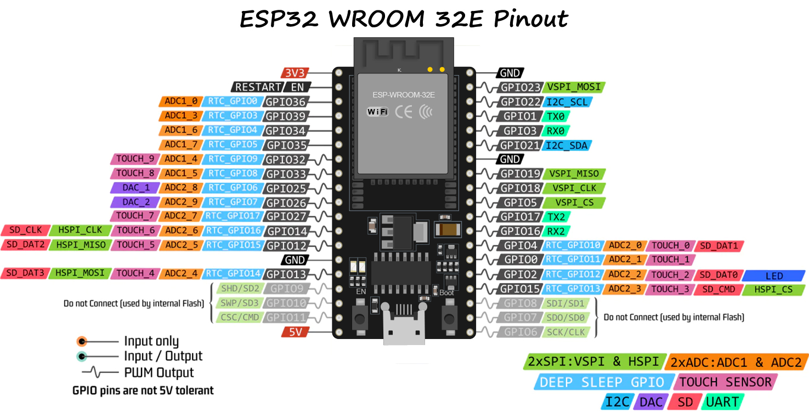

# 🚀 Audio Recorder with ESP32 & SD Card

## 📜 Description
This project allows recording audio at **16 bits @ 44.1 kHz**.  
It uses an SPI SD Card connection, ESP32 (tested models: Wroom 32S and ESP32S3), and an audio codec (PMOD I2S2 in this project).

---

## 🛠️ Hardware Requirements

### **ESP32 (Wroom 32S or ESP32S3)**  
- Microcontroller responsible for recording audio data and interfacing with the audio codec and SD card.  
- Equipped with sufficient serial peripherals to manage I2S in full duplex mode, Master Clock, and the SPI bus.  
  > **Note:** SDIO has not yet been tested as of December 2024.

  
  
<em>ESP32 S3</em>

  
  
<em>ESP32 32E</em>

> **Important Note:**  
> Regardless of datasheet statements suggesting any I2S pin can be connected to any GPIO, the **Master Clock** can only be used for **GPIO 0** on the WROOM 32E.

---

### **[PMOD I2S2 Audio Codec](https://digilent.com/reference/pmod/pmodi2s2/reference-manual)**  
- Converts audio signals for the ESP32.  
- Requires Master Clock.  
- This module includes both DAC and ADC functionalities, simplifying audio testing.

  
  
<em>PMOD I2S2</em>

  
  
<em>PMOD I2S2 Pinout</em>

---

### **SPI Compatible SD Card Module**  
- Connected through SPI for storing recorded audio. Must have sufficient speed to prevent audio sample loss during recording.  
- Most SD modules are SPI-compatible, which is the simplest but slowest way to connect a microcontroller such as the ESP32 MCU.  
- Some modules support 3.3V and 5V power supply inputs. SD cards only work with **3.3V**.  

  
  
<em>SPI SD Card Module</em>

---

### **SD Card**  
- A critical component that must have sufficient speed to avoid audio loss. This affects bit depth, which is why this project records at **16 bits @ 44.1 kHz** only.  
- SD Card speeds are often indicated by logos printed on them. SD cards rated **faster than 30 MB/sec** are considered suitable for this project.
- Audio file size can be calculated with [Audio File Size Calculator](https://www.omnicalculator.com/other/audio-file-size).

  
  
<em>SD Speed Class</em>

### **Sketch**  
- The sketch is developed using Arduino IDE, allowing comparison of different MCUs without the need to learn new IDEs for each platform. Currently, only ESP MCUs have been tested because I2S with MCLK is not widely supported on other MCU platforms.
- The I2S driver provided by Espressif Systems is unique and not compatible with other platforms.
Similarly, the STM32 platform poses compatibility challenges. I have configured the necessary setup using STM32CubeIDE and I am in the process of porting it to Arduino IDE.

---
